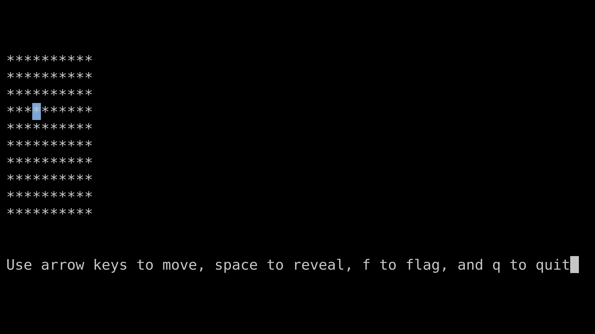

# msweep-rs - Terminal Minesweeper Implementation in Rust



### Build/Install

- To build: `cargo build --release; sudo cp target/release/msweep-rs /usr/local/bin/msweep`

### Usage

`./msweep <board size> <number of mines>`

#### Controls

- `Arrow Keys` to move cursor
- `Space` to reveal a cell
- `F` to flag a cell
- `Q` to quit


### License:

```
This program is free software.
It is licensed under the GNU GPL version 3 or later.
That means you are free to use this program for any purpose;
free to study and modify this program to suit your needs;
and free to share this program or your modifications with anyone.
If you share this program or your modifications
you must grant the recipients the same freedoms.
To be more specific: you must share the source code under the same license.
For details see https://www.gnu.org/licenses/gpl-3.0.html
```
